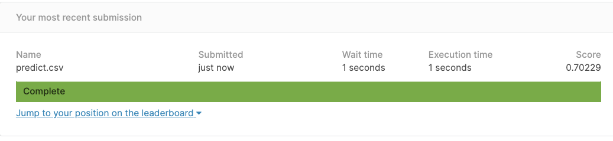

# hw6

## kaggle snapshop

k = 10, with the highest test AUC 0.7 in k-fold cross-validation

## GiveMeSomeCredit

Start here! Predict the probability that somebody will experience financial distress in the next two years (column=SeriousDlqin2yrs).

[GiveMeSomeCredit](https://www.kaggle.com/c/GiveMeSomeCredit/overview)

## Steps

1. perform *k*-fold cross-validation on the training data under three-way split to select the best prediction model
    + you could try many different models, then only implement the best model in your code
2. report the average AUC of cross-validation (training, validation, testing in *k*-fold cross-validation i.e., hw4) with the option, --report
3. *k* = ?, with the highest test AUC in *k*-fold cross-validation 
4. then apply the selected model on the Kaggle test data
5. output prediction result (--predict)
   
```R
Rscript hw6_studentID.R --fold n --train Data/train.csv --test Data/test.csv --report performance.csv --predict predict.csv
```

5. Submit your prediction to Kaggle system under display name: 1101DS@NCCU_[yourname]
6. Make a snapshot of your submissions and update in your README.md


## Score

* 15 potins: each testing parameter from 5 to 10 fold

```R
Rscript hw6_9999.R --fold 5 --train Data/train.csv --test Data/test.csv --report performance1.csv --predict predict.csv
...
Rscript hw6_9999.R --fold 10 --train Data/train.csv --test Data/test.csv --report performance6.csv --predict predict.csv
```

* 2 points: round number to two decimal place
* Performance Bonus: the average AUC of testing data in cross-validation based on the selected *k*
  * 0.85 ~ : 4 points
  * 0.80 ~ 0.85: 3 points
  * 0.70 ~ 0.80: 2 points
  * 0.60 ~ 0.70: 1 points
* 4 points: the above AUC is closed to the score of Kaggle (<= 0.05)
* -5 points: without training, calibration, testing answer (-5 points of each answer)

## Notice
* Please use *R* version 3.6.3
* Please do not set input/output in your local path or URL. Otherwise, your code will fail due to fixed path problem.
